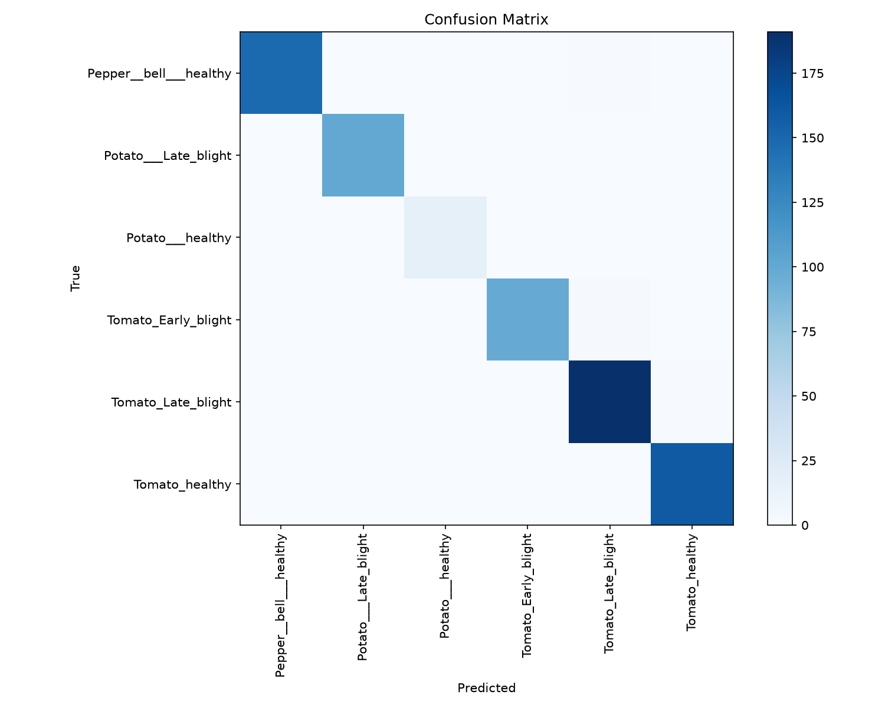
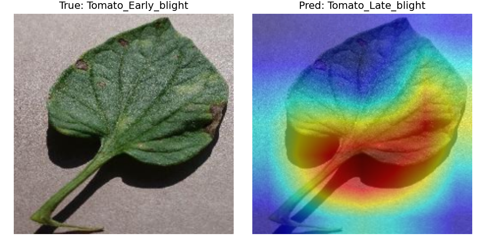
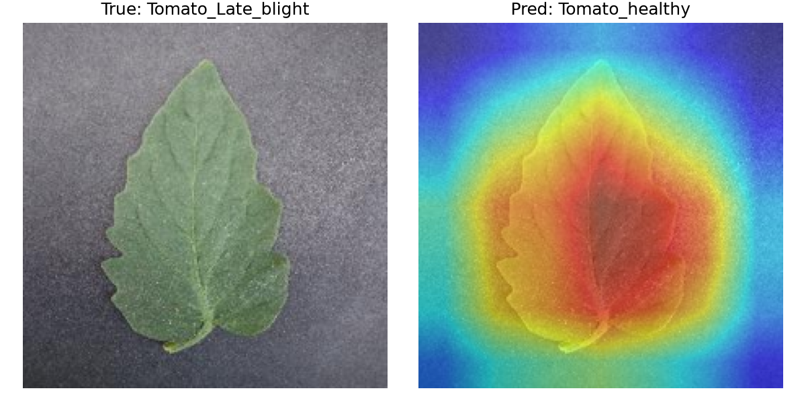
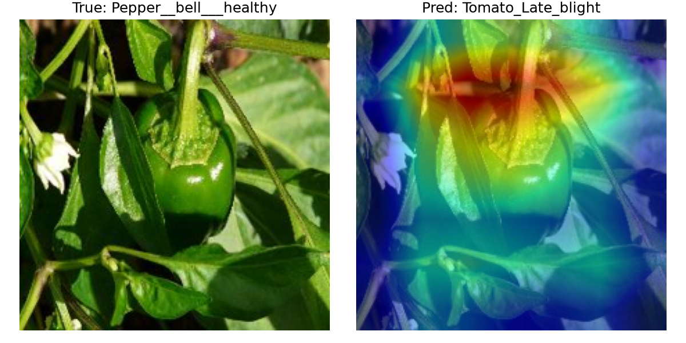

# Explainable Leaf Disease Classifier

A plant disease classifier that predicts and shows its reasoning. 99% test accuracy, verified with Grad-CAM explainability to confirm the model is learning the right signal, not cheating on a lab-clean dataset.

## 1. What Problem Did I Solve?

Plant disease destroys a significant share of crops worldwide, with manual field inspection failing to scale. The challenge is to build an automated system that can reliably classify a leaf as healthy or diseased based on a single photo (and identify which disease), with a visual check as to *why* it made that decision - can I trust the reasoning, not just the accuracy number it reports?

A high accuracy score is poor evidence of a well-reasoned model on its own, since it could be exploiting some accidental shortcut in the data. This project is therefore inspectable end-to-end, not just performant.

## 2. Tools & Skills Used

- **Language:** Python
- **ML framework:** PyTorch, torchvision (transfer learning, ResNet18)
- **Explainability:** Grad-CAM (`pytorch-grad-cam`)
- **Evaluation:** scikit-learn (classification report, confusion matrix)
- **Data handling:** NumPy, PIL
- **Visualisation:** Matplotlib
- **Tooling:** Git, GitHub, virtual environments (venv)

## 3. How I Approached It

**Prepare → Train → Evaluate → Explain → Report**

1. **Prepare** — Split a 6-class subset of the PlantVillage dataset (downloaded from Kaggle, ~7,100 images across tomato, potato, and pepper) into train/validation/test sets (80/10/10), performed before any training so the test set stays genuinely unseen.
2. **Train** — Fine-tuned a ResNet18 pretrained on ImageNet via transfer learning, rather than training from scratch, for efficiency and higher performance on a smaller dataset. Validation accuracy was tracked every epoch, keeping only the best-performing checkpoint.
3. **Evaluate** — Ran the best model once, on the held-out test set it had never seen in any capacity, producing an honest classification report and confusion matrix.
4. **Explain** — Used Grad-CAM to generate attention heatmaps on both correct and incorrect predictions, to check *what* the model was actually looking at, not just whether it got the right answer.
5. **Report** — Documented results and limitations honestly, including where the model's reasoning was legitimate and where it was unsatisfactory.

## 4. Where Is the Code

| Step | Script |
|---|---|
| Data preparation | [`scripts/1_prepare_data.py`](scripts/1_prepare_data.py) |
| Model training | [`scripts/2_train.py`](scripts/2_train.py) |
| Evaluation | [`scripts/3_evaluate.py`](scripts/3_evaluate.py) |
| Explainability (Grad-CAM) | [`scripts/4_gradcam.py`](scripts/4_gradcam.py) |

**Run it yourself:**
```bash
git clone https://github.com/grace-mcmahon/explainable-leaf-classifier.git
cd explainable-leaf-classifier
python -m venv venv
source venv/bin/activate      # Windows: venv\Scripts\activate
pip install -r requirements.txt

# Download PlantVillage from Kaggle, unzip, place class folders under data/raw/
python scripts/1_prepare_data.py
python scripts/2_train.py
python scripts/3_evaluate.py
python scripts/4_gradcam.py
```
## 5. What Was the Outcome
**99% test accuracy across 6 classes. Confirmed by Grad-CAM as the model looks at the leaf, not the shortcut.**

| Class | Precision | Recall | F1 | Support |
|-------|-----------|--------|----|---------|
| Pepper (Bell) - Healthy | 1.00 | 0.99 | 1.00 | 149 |
| Potato - Late Blight | 1.00 | 1.00 | 1.00 | 100 |
| Potato - Healthy | 1.00 | 1.00 | 1.00 | 16 |
| Tomato - Early Blight | 1.00 | 0.98 | 0.99 | 100 |
| Tomato - Late Blight | 0.98 | 0.99 | 0.99 | 192 |
| Tomato - Healthy | 0.99 | 1.00 | 1.00 | 160 |



*(Roughly 1% of test images were misclassified, too small a number to register visually on the confusion matrix at this scale.)*

Errors broke into three different types as opposed to one repeated failure pattern:

**① Genuine visual ambiguity** -  Early Blight was mistaken for Late Blight, attention was correctly focused on the lesion. Two diseases that look alike to the trained eye.



**② A subtle, borderline case** - a mildly-diseased leaf incorrectly read as healthy, attention correctly placed, symptom too faint to catch. 



**③ The real limitation** - a healthy pepper leaf misread as diseased tomato, with attention focused on the stem and background, not the plant tissue. This is the only case where the model's reasoning - not just its answer - was incorrect, and the clearest signal of where more data or regularisation would help. 



## Data Quality Notes
**Class imbalance:** Potato - Healthy has noticeably fewer images than the other classes, so its perfect scores are likely helped by a smaller test sample compared to the rest.

**Dataset realism:** PlantVillage is a lab-controlled dataset (i.e. plain background, consistent lighting, single leaf per image). Real-world field photos are messier, and I'd expect accuracy to drop without further data augmentation or fine-tuning on field conditions.

## What I'd Do Next
- Test on real-world field photos in order to get an honest read on out-of-distribution performance
- Address the Potato - Healthy class imbalance with targeted augmentation
- Investigate whether the attention-misplacement error is a one-off or a pattern across more cross-species images
- Deploy behind a small web demo so the model can be tried directly, not just read about